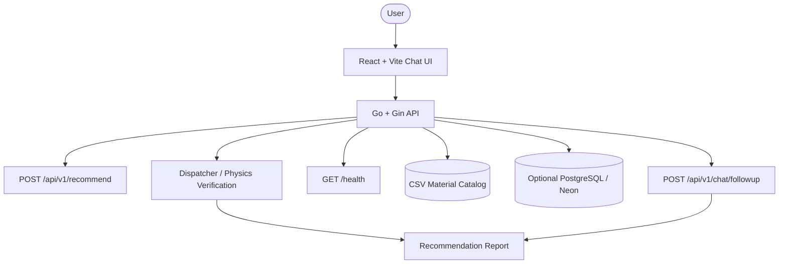

# Smart Alloy Selector

Met-Quest '26 material recommendation workspace with a Go backend and a React/Firebase frontend. The current UI is chat-first: a session sidebar on the left, a single conversation surface in the center, and a compact composer at the bottom.

## Live Links

- Frontend: https://met-quest.web.app
- API: https://vivekwa-met-quest-api.hf.space
- Health check: https://vivekwa-met-quest-api.hf.space/health

## What the App Does

- Lets you ask material-selection questions in plain language.
- Returns a ranked recommendation response with a generated report.
- Keeps chat sessions in local storage so conversations persist across reloads.
- Supports follow-up turns in the same chat thread through a dedicated chat endpoint that uses the existing question/answer context.
- Shows the top recommendation, shortlist, and report text in a compact conversational layout.
- Includes optional copy and report expand controls on assistant messages.
- Deploys the frontend through Firebase Hosting.

## Current UI

The frontend is intentionally minimal now:

- Left sidebar for saved sessions.
- Main chat transcript area.
- Bottom message composer with send button only.
- No constraints panel in the current UI.
- No extra workflow buttons beyond new chat, session selection, and send.

## Responsive UX And Sidebar Collapse Approach

The frontend now supports a consistent sidebar experience across desktop and mobile, with explicit viewport-aware behavior and tighter small-screen layout handling.

### Problem Analysis

- The session history panel behaved like a permanent desktop column but a mobile drawer on smaller screens.
- Collapse/expand behavior was reliable on mobile but not robust as a true desktop collapse mode.
- A few chat and navigation elements could feel cramped on very small screens.

### Implementation Strategy

1. Viewport-aware state in the app shell:
   - Added explicit viewport mode tracking (`<= 980px` considered mobile).
   - Sidebar default remains open on desktop and closed on mobile.
2. Unified sidebar toggle behavior:
   - The sidebar toggle is now available in the top bar for both desktop and mobile.
   - On desktop, toggle collapses/expands the sidebar column.
   - On mobile, toggle opens/closes an overlay drawer.
3. Distinct desktop vs mobile rendering rules:
   - Desktop collapse uses a shell-level collapsed state (`grid-template-columns: 0 1fr`) and hides sidebar interaction when collapsed.
   - Mobile keeps the fixed-position drawer plus backdrop behavior.
4. Chat and navigation responsiveness hardening:
   - Improved tiny-screen spacing, font sizes, and message header wrapping.
   - Switched mobile chat panel viewport sizing to `100dvh` semantics for better behavior on modern mobile browsers.

### Breakpoints Used

- `980px`: switch between desktop sidebar column and mobile drawer pattern.
- `720px`: compact home/chat navigation presentation.
- `640px`: compact chat message/composer presentation.
- `560px`: compact top navigation sizing and actions.

### Files Updated For This Change

- `frontend/src/App.tsx`
  - Added viewport mode state and desktop/mobile-aware sidebar behavior.
  - Added desktop collapsed shell class handling.
  - Limited backdrop rendering to mobile-only sidebar overlays.
- `frontend/src/styles/index.css`
  - Added desktop collapsed shell/sidebar styles.
  - Kept mobile drawer behavior intact under `max-width: 980px`.
  - Added additional tiny-screen navigation and typography adjustments.
- `frontend/src/styles/chat.css`
  - Improved mobile panel height handling using `100dvh`.
  - Added compact chat message/header/composer styles for smaller widths.

### Expected Behavior After Change

- Desktop (`> 980px`):
  - Sidebar is visible by default.
  - Toggle button collapses and reopens recent chats without breaking main chat layout.
- Mobile (`<= 980px`):
  - Sidebar opens as a drawer.
  - Drawer closes via toggle, session selection, new session action, or backdrop tap.
  - Main chat remains full-width and scroll behavior is preserved.

### Validation Checklist

1. Desktop test (`> 980px`): open chat page, toggle recent chats closed/open repeatedly.
2. Tablet/mobile test (`<= 980px`): open drawer, select session, verify drawer closes.
3. Small-phone test (`<= 640px`): verify message header actions do not overlap and composer remains usable.
4. Route test (`/` and `/chat`): confirm both home and chat pages remain functional.
5. Frontend production build:

```bash
cd frontend
npm run build
```

If all pass, the responsiveness and sidebar collapse update is considered complete.

## Architecture Overview



## Frontend Flow

The frontend uses a simple chat flow:

1. The first user message is sent to `POST /api/v1/recommend`.
2. The assistant response is stored in the active session.
3. Later turns are sent to `POST /api/v1/chat/followup` with recent history and the first answer so the chat stays conversational instead of rerunning the full pipeline.
4. The session history sidebar lets you switch between conversations.

### UI Behavior

- The interface is intentionally simple and chat-first.
- The old constraints panel is no longer part of the main flow.
- The UI keeps only the actions that are still useful: new chat, session selection, message input, send, copy, and expand/collapse report.
- The sidebar can be used to switch between saved sessions, while the main area stays focused on the conversation.

### Frontend Files

- `frontend/src/App.tsx`: app shell, sidebar, API status, session selection, and message submission.
- `frontend/src/components/ChatPanel.tsx`: transcript renderer, empty state, composer, copy/expand controls.
- `frontend/src/components/ChatHistory.tsx`: session list and new-chat action.
- `frontend/src/api/client.ts`: recommend, follow-up chat, and health helpers.
- `frontend/src/hooks/useChatStorage.ts`: localStorage-backed session persistence.

## Backend API Surface

| Method | Endpoint | Purpose |
| --- | --- | --- |
| `GET` | `/health` | Liveness check. |
| `POST` | `/api/v1/recommend` | Material recommendation request used for the first assistant response. |
| `POST` | `/api/v1/chat/followup` | Follow-up assistant chat response using prior conversation context. |
| `POST` | `/api/v1/recommend/dispatcher` | Dispatcher and physics-verification flow used by backend validation and advanced routing. |
| `POST` | `/api/v1/predict` | Alloy composition prediction. |

### Recommendation Request

```json
{
  "query": "Need a lightweight alloy for aircraft wing components with fatigue resistance",
  "domain": "Overall (Top 1000)"
}
```

### Follow-up Request

```json
{
  "message": "Can you narrow it to something with better corrosion resistance?",
  "history": [
    { "role": "user", "content": "Need a lightweight alloy for aircraft wing components with fatigue resistance" },
    { "role": "assistant", "content": "..." }
  ],
  "initial_report": "...",
  "top_recommendations": ["7075 Aluminum", "Ti-6Al-4V", "2024 Aluminum"]
}
```

## Backend Summary

The backend lives in `backend/` and is written in Go.

- `backend/main.go`: starts the Gin server, loads environment variables, configures routes, CORS, and optional Postgres.
- `backend/handlers/recommend.go`: material recommendation and dispatcher handlers.
- `backend/handlers/predict.go`: alloy prediction endpoint.
- `backend/services/llm.go`: recommendation, follow-up, dispatcher, and analysis logic.
- `backend/services/vector.go`: hybrid retrieval support.
- `backend/services/csv_db.go`: CSV catalog loader and fallback search.
- `backend/services/predictor.go`: rule-of-mixtures and prediction refinement.
- `backend/db/postgres.go`: optional PostgreSQL connection handling.

## Data Sources

The app is CSV-first and can run without a database.

- `data/materials_cleaned.csv`: full material catalog.
- `data/polymers.csv`: polymer subset.
- `data/metals.csv`: metal and alloy subset.
- `data/ceramics.csv`: ceramic subset.
- `data/composites.csv`: composite subset.
- `data/schema.sql`: PostgreSQL schema.
- `data/seed_db.py`: optional loader.

## Local Setup

### Prerequisites

- Go 1.24 or compatible with `backend/go.mod`
- Node.js and npm
- Optional: Python 3 for data scripts
- Optional: Firebase CLI for frontend deployment

### Environment Variables

Create `.env` in the project root:

```env
GEMINI_API_KEY=your_google_ai_studio_key
OPENROUTER_API_KEY=your_openrouter_key
DATABASE_URL=postgres_connection_string_optional
ALLOWED_ORIGINS=http://localhost:5173,https://met-quest.web.app
PORT=8080
VITE_API_URL=http://localhost:8080/api/v1
```

`GEMINI_API_KEY` is preferred. `DATABASE_URL` is optional because the backend can run from CSV data alone.

### Run Backend

```bash
cd backend
go run main.go
```

### Run Frontend

```bash
cd frontend
npm install
npm run dev
```

## Testing

### Backend Build

```bash
cd backend
go build -o server .
```

### Frontend Build

```bash
cd frontend
npm run build
```

### Dispatcher Validation

```bash
./test_dispatcher_validation.sh
```

### Hackathon Validation

```bash
./test_hackathon_cases.sh
```

Expected result: `Passed: 10`, `Failed: 0`.

## Deployment

### Firebase Hosting

The frontend is deployed from `frontend/dist` using the Firebase Hosting rewrite configured in `firebase.json`.

```bash
cd frontend
npm run build
cd ..
npx -y firebase-tools@latest deploy --only hosting
```

Production note:
Firebase Hosting auto-deploys from GitHub `main` through `.github/workflows/firebase-hosting-merge.yml`. A manual local deploy can be overwritten by the next GitHub-triggered deploy if the same frontend changes are not committed and pushed to `main`.

### Backend

The API is deployed separately through the Hugging Face Space / Docker workflow documented in `DEPLOYMENT.md`.

## Notes

- The current frontend does not use the old constraints panel.
- Chat sessions are stored locally in the browser.
- The app is designed to keep the UI simple: sessions, chat, and send.
- Follow-up replies use chat context, so they should read like a normal assistant response rather than a repeated pipeline report.
- If you change the API URL, update `VITE_API_URL` before building the frontend.

## Team

Built for **MET-QUEST '26** by **Team Tech Titans**.
