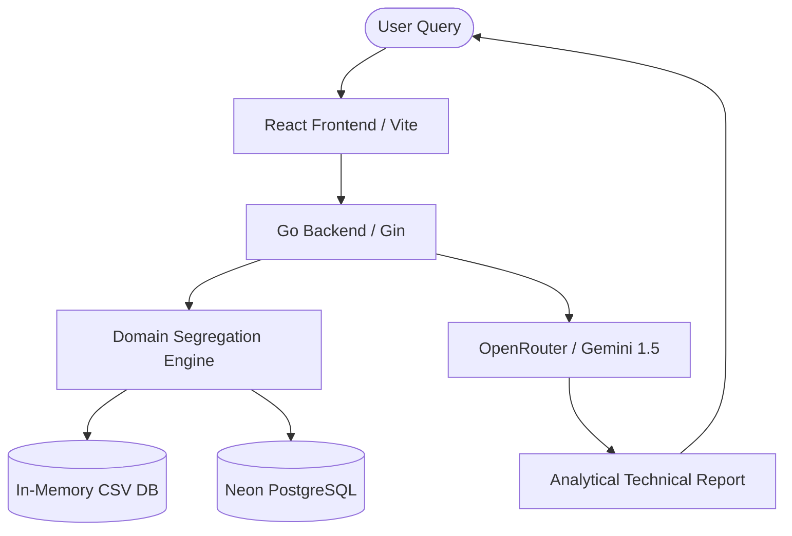

# Smart Alloy Selector: Tech Titans 🚀
**Needle in the Data-Stack: The AI-Powered Virtual Materials Scientist**

Built for the **MET-QUEST ’26** engineering competition, this platform is the official submission from **Team Tech Titans**. It is a high-performance material recommendation and predictive modeling system that replaces the grueling manual process of scraping disjointed tables (MatWeb, NASA TPSX) with a unified, **Long-Context RAG** engine.

---

## 🏗️ System Architecture



---

## 📂 File-by-File Technical Analysis

### 🌐 Project Root
| File | Responsibility |
|------|----------------|
| `firebase.json` | Configuration for Firebase Hosting (Frontend targets `frontend/dist`). |
| `.env.example` | Template for environment variables (API Keys, DB URL). |
| `PROJECT_CHARTER.md` | Strategic overview of the project goals and architectural constraints. |
| `DEPLOYMENT.md` | Manual troubleshooting guide for Cloud Run and Firebase. |

### 🧠 Backend (`/backend`)
The core processing engine built in Golang.
| File | Logic |
|------|-------|
| `main.go` | Server entry point. Orchestrates the Gin router, CORS, and endpoint lifecycle. |
| `handlers/recommend.go` | Entry point for natural language material queries. |
| `handlers/predict.go` | Orchestrates the two-phase custom alloy property predictor. |
| `services/llm.go` | **The AI Core.** Implements Intent Extraction and **Long-Context Analyze**. |
| `services/csv_db.go` | High-speed engine that parses 8k+ materials into RAM at startup. |
| `services/predictor.go` | Implements Rule-of-Mixtures (Phase 1) and LLM Refinement (Phase 2). |
| `db/postgres.go` | Manages the Neon PostgreSQL connection pool with automated mock fallback. |
| `models/material.go` | Central Go structs for Materials, Search Intents, and AI Reports. |
| `Dockerfile` | Multi-stage production build (Go / Alpine) with bundled data assets. |

### 🎨 Frontend (`/frontend`)
A modern React application built for speed and visual excellence.
| File | UI / UX Role |
|------|--------------|
| `src/App.tsx` | Main application shell. Manages state for the AI search results. |
| `src/components/QueryInput.tsx` | Specialized search interface with **Engineering Domain** selection. |
| `src/components/PredictorPanel.tsx` | Dynamic composition builder with real-time property charts. |
| `src/components/ReportCard.tsx` | Renders the AI's "Virtual Scientist" report with Markdown support. |
| `src/api/client.ts` | Type-safe Axios bridge for production and local backend calls. |
| `src/styles/index.css` | Custom CSS design system (Glassmorphism, Vibrant Dark Mode). |

### 📊 Data Pipeline (`/data`)
The lifecycle of the 8,759-entry materials database.
| File | Data Life Cycle |
|------|-----------------|
| `fetch_materials.py` | Python script to ingest 15,000+ raw records from Materials Project. |
| `seed_db.py` | Optimized bulk uploader for Neon/Postgres using `execute_values`. |
| `schema.sql` | DDL for the structured `materials` and `elements` tables. |
| `materials_cleaned.csv` | **Source of Truth.** The cleaned dataset used by the In-Memory engine. |

---

## ✨ Key Innovations (Brownie Points)

### 1. Long-Context RAG (LCR)
Traditional vector search loses the "holistic" engineering comparison. This project uses **LCR**, injecting up to 1,000 relevant materials directly into the LLM's context window. This allows the AI to "read" the entire catalog simultaneously, just like a human scientist.

### 2. Domain Segregation Engine
To maintain high precision without hitting token limits, we implemented **Domain Segregation**. The backend applies physics-based filters (e.g., *Aerospace*, *Biomedical*, *Plastics*) to mathematically narrow the search space before sending it to the AI.

### 3. Two-Phase Property Predictor
For alloys not in the database:
- **Phase 1**: Programmatic **Rule-of-Mixtures** calculation from elemental data.
- **Phase 2**: **Thermodynamic Refinement** via Gemini to account for crystalline phase stability and fatigue resistance.

---

## 🚀 Setup & Execution

### 1. Configure Environment
Create a `.env` file in the root:
```env
OPENROUTER_API_KEY=your_key_here
```

### 2. Run Backend
```bash
cd backend
go run main.go
```

### 3. Run Frontend
```bash
cd frontend
npm install
npm run dev
```

### 4. Sync Database (Optional)
```bash
cd data
python3 seed_db.py
```

---

## 🏆 Development Team
Designed and Engineered for **MET-QUEST ’26**. 
- **Team**: Tech Titans
- **AI Engine**: LCR-Node-L (Gemini-1.5 Optimized)
