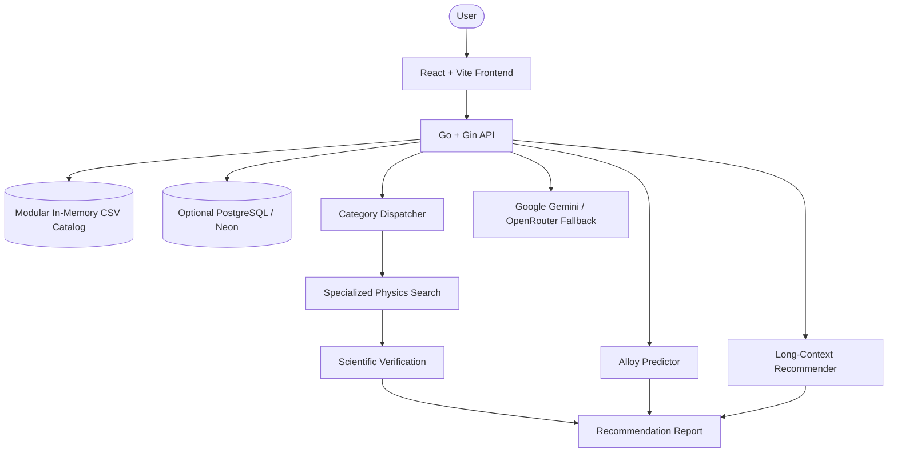

# Smart Alloy Selector - Tech Titans

AI-powered material recommendation and alloy prediction platform built for **MET-QUEST '26**.

The project combines a Go/Gin backend, a React/Vite frontend, modular materials CSV catalogs, optional PostgreSQL storage, and Gemini-powered analysis to act like a virtual materials scientist for engineering design queries.

## Live Links

- **Frontend:** [met-quest.web.app](https://met-quest.web.app)
- **API:** [vivekwa-met-quest-api.hf.space](https://vivekwa-met-quest-api.hf.space)
- **Health check:** [vivekwa-met-quest-api.hf.space/health](https://vivekwa-met-quest-api.hf.space/health)

## What It Does

- Recommends materials from natural-language engineering requirements.
- Routes advanced queries through a category-aware dispatcher for polymers, alloys, pure metals, ceramics, and composites.
- Runs physics-focused verification before returning the final recommendation.
- Predicts custom alloy properties from element composition using rule-of-mixtures plus LLM refinement.
- Loads the materials catalog from local CSV files by default, with optional Neon/PostgreSQL support.
- Falls back gracefully when Postgres or an LLM provider is unavailable.

## Current Architecture



## API Surface

| Method | Endpoint | Purpose |
| --- | --- | --- |
| `GET` | `/health` | API liveness check. |
| `POST` | `/api/v1/recommend` | Legacy long-context material recommendation endpoint used by the current frontend. |
| `POST` | `/api/v1/recommend/dispatcher` | New category-aware dispatcher with specialized search and physics verification. |
| `POST` | `/api/v1/predict` | Custom alloy composition prediction. |

### Recommendation Request

```json
{
  "query": "Need a lightweight alloy for aircraft wing components with fatigue resistance",
  "domain": "Aerospace & Aviation"
}
```

### Alloy Prediction Request

```json
{
  "composition": {
    "Al": 90,
    "Zn": 6,
    "Mg": 2,
    "Cu": 2
  }
}
```

## Backend Highlights

The backend lives in [`backend/`](backend/) and is written in Go.

- [`backend/main.go`](backend/main.go): starts the Gin server, loads environment variables, connects to Postgres when available, loads the CSV catalog, configures CORS, and registers routes.
- [`backend/handlers/recommend.go`](backend/handlers/recommend.go): contains both the legacy recommendation handler and the new dispatcher handler.
- [`backend/handlers/predict.go`](backend/handlers/predict.go): validates alloy composition requests and calls the predictor service.
- [`backend/services/llm.go`](backend/services/llm.go): provider-aware Gemini/OpenRouter calls, intent extraction, long-context analysis, dispatcher routing, specialized search, and scientific analysis.
- [`backend/services/csv_db.go`](backend/services/csv_db.go): loads modular CSV catalogs into memory for fast local and production fallback searches.
- [`backend/services/predictor.go`](backend/services/predictor.go): computes rule-of-mixtures baselines and asks the LLM for thermodynamic refinement.
- [`backend/db/postgres.go`](backend/db/postgres.go): optional PostgreSQL connection pool with mock-mode fallback.

### LLM Provider Behavior

The backend prefers a valid `GEMINI_API_KEY` and can also use `OPENROUTER_API_KEY`.

Provider flow:

1. Google AI Studio Gemini models are tried first.
2. Temporary quota and availability failures are tracked with model-level backoff.
3. OpenRouter is used as a fallback when a valid OpenRouter key is present.
4. If no valid key exists, the service returns mock AI responses where supported so local development still works.

## Dispatcher Pipeline

The dispatcher endpoint adds the newest recommendation flow:

1. `RouteQuery()` classifies the query into `Polymers`, `Alloys`, `Pure_Metals`, `Ceramics`, or `Composites`.
2. The backend loads candidates from Postgres when available, otherwise from the in-memory CSV catalog.
3. `ExtractIntent()` converts natural language constraints into filter ranges.
4. Category-specific search ranks candidates using relevant engineering properties.
5. `ScientificAnalysis()` performs physics-driven checks, merit-index reasoning, failure rejection notes, manufacturing feasibility, and safety-margin analysis.

More detail is available in:

- [`DISPATCHER_IMPLEMENTATION.md`](DISPATCHER_IMPLEMENTATION.md)
- [`DISPATCHER_QUICK_REFERENCE.md`](DISPATCHER_QUICK_REFERENCE.md)
- [`DISPATCHER_SUMMARY.md`](DISPATCHER_SUMMARY.md)
- [`IMPLEMENTATION_VERIFICATION.md`](IMPLEMENTATION_VERIFICATION.md)

## Frontend

The frontend lives in [`frontend/`](frontend/) and uses React, TypeScript, Vite, and Axios.

- [`frontend/src/App.tsx`](frontend/src/App.tsx): main two-tab application shell for material recommendation and alloy prediction.
- [`frontend/src/components/QueryInput.tsx`](frontend/src/components/QueryInput.tsx): natural-language material query form.
- [`frontend/src/components/PredictorPanel.tsx`](frontend/src/components/PredictorPanel.tsx): custom alloy composition workflow.
- [`frontend/src/components/ReportCard.tsx`](frontend/src/components/ReportCard.tsx): renders the virtual scientist report.
- [`frontend/src/components/PropertyTable.tsx`](frontend/src/components/PropertyTable.tsx): compares returned material properties.
- [`frontend/src/api/client.ts`](frontend/src/api/client.ts): API client. Defaults to the Hugging Face backend and supports `VITE_API_URL` overrides.

## Data Pipeline

The data layer is CSV-first, with optional database sync.

| Path | Purpose |
| --- | --- |
| [`data/materials_cleaned.csv`](data/materials_cleaned.csv) | Full cleaned catalog fallback. |
| [`data/polymers.csv`](data/polymers.csv) | Polymer catalog. |
| [`data/metals.csv`](data/metals.csv) | Metal and alloy catalog. |
| [`data/ceramics.csv`](data/ceramics.csv) | Ceramic catalog. |
| [`data/composites.csv`](data/composites.csv) | Composite catalog. |
| [`data/schema.sql`](data/schema.sql) | PostgreSQL schema. |
| [`data/seed_db.py`](data/seed_db.py) | Bulk CSV to Postgres loader. |
| [`data/fetch_materials.py`](data/fetch_materials.py) | Materials Project ingestion helper. |

The backend also contains deployment-ready copies under [`backend/data/`](backend/data/) for Docker/Hugging Face packaging.

## Local Setup

### Prerequisites

- Go 1.24 or compatible with the module in [`backend/go.mod`](backend/go.mod)
- Node.js and npm
- Optional: Python 3 for data ingestion scripts
- Optional: Firebase CLI for frontend deployment

### Environment Variables

Create `.env` in the project root when running locally:

```env
GEMINI_API_KEY=your_google_ai_studio_key
OPENROUTER_API_KEY=your_openrouter_key
DATABASE_URL=postgres_connection_string_optional
ALLOWED_ORIGINS=http://localhost:5173,https://met-quest.web.app
PORT=8080
```

Only one valid LLM key is required. `GEMINI_API_KEY` is preferred. `DATABASE_URL` is optional because the backend can run from CSV alone.

### Run Backend

```bash
cd backend
go run main.go
```

The API starts on `http://localhost:8080` unless `PORT` is set.

### Run Frontend

```bash
cd frontend
npm install
npm run dev
```

For local frontend-to-local-backend calls, set:

```env
VITE_API_URL=http://localhost:8080/api/v1
```

## Testing

### Backend Build

```bash
cd backend
go build -o server .
```

### Frontend Build

```bash
cd frontend
npm run build
```

### Dispatcher API Test Suite

Start the backend first, then run:

```bash
./test_dispatcher.sh
```

The script exercises polymer, alloy, ceramic, composite, pure-metal, and edge-case queries against `/api/v1/recommend/dispatcher`.

## Optional Database Workflow

The app runs without Postgres, but a database can be used for production-scale querying.

```bash
cd data
python3 -m pip install -r requirements.txt
python3 seed_db.py
```

Set `DATABASE_URL` before running the seed script or backend.

## Deployment

### Backend: Hugging Face Spaces

The root [`Dockerfile`](Dockerfile) and backend [`backend/Dockerfile`](backend/Dockerfile) support container deployment. The public API is currently hosted as a Hugging Face Docker Space.

Required secret:

```env
GEMINI_API_KEY=your_key
```

Optional secrets:

```env
OPENROUTER_API_KEY=your_key
DATABASE_URL=your_postgres_url
ALLOWED_ORIGINS=https://met-quest.web.app
```

### Frontend: Firebase Hosting

Build and deploy the Vite app:

```bash
cd frontend
npm run build
cd ..
firebase deploy --only hosting
```

Firebase hosting is configured in [`firebase.json`](firebase.json).

## Project Notes

- The frontend currently calls the legacy `/recommend` endpoint for the recommender tab.
- The new dispatcher endpoint is implemented and testable through `/recommend/dispatcher`.
- The CSV catalog is the default operational source, so local development does not require a database.
- Generated artifacts such as `backend/server`, logs, and Firebase cache files may appear after builds or deployments.

## Team

Built for **MET-QUEST '26** by **Team Tech Titans**.
